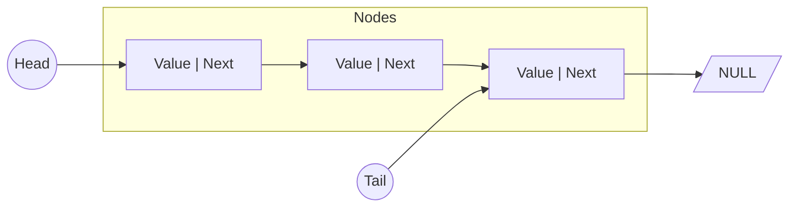
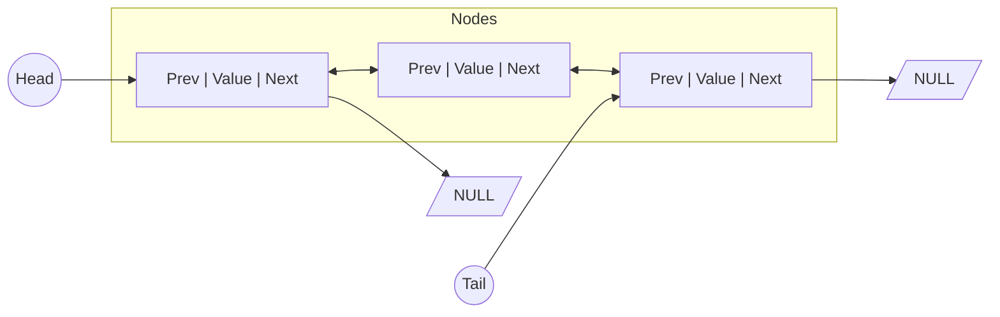

# Linked List (链表)

链表是一种线性数据结构，其中的元素不是存储在连续的内存地址中，而是通过指针连接。

## Singly Linked List (单向链表)

每个节点包含数据和一个指向下一个节点的指针。

### 结构图

### 操作复杂度
| 操作 | 平均复杂度 | 最坏复杂度 |
| :--- | :--- | :--- |
| PushFront | O(1) | O(1) |
| PushBack | O(1) | O(1) |
| Get | O(n) | O(n) |
| Remove | O(n) | O(n) |

---

## Doubly Linked List (双向链表)

每个节点包含数据、指向下一个节点的指针和指向前一个节点的指针。

### 结构图

### 操作复杂度
| 操作 | 平均复杂度 | 最坏复杂度 |
| :--- | :--- | :--- |
| PushFront | O(1) | O(1) |
| PushBack | O(1) | O(1) |
| Get | O(n/2) | O(n) |
| Remove | O(1) * | O(1) |

*\* 如果已知节点指针，删除为 O(1)。按索引删除仍需 O(n)。*
