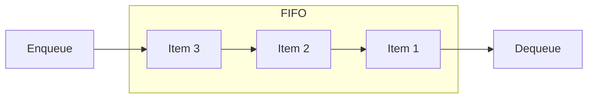
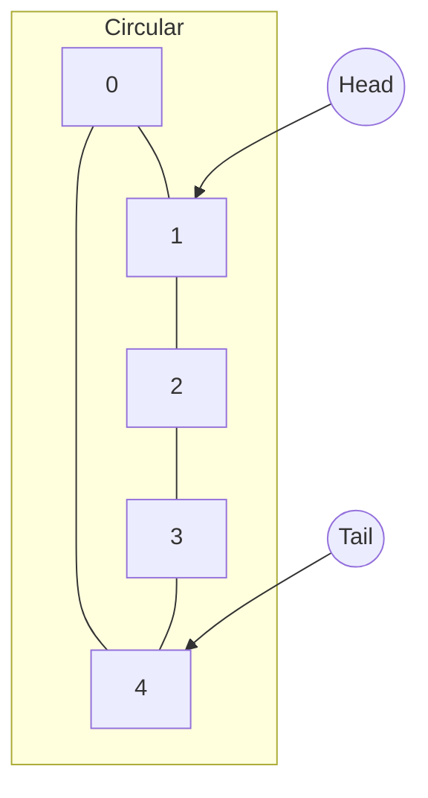

# Queue (队列)

队列是一种先进先出 (FIFO, First-In First-Out) 的线性数据结构。

## 普通队列 (Queue)

## 环形队列 (Circular Queue)
环形队列利用固定大小的数组和两个指针（头、尾）来循环利用存储空间。

## 实现对比
- **SliceQueue**: 简单易用，但 `Dequeue` 操作（`q.items[1:]`）可能导致底层数组内存无法释放。
- **ListQueue**: 基于链表，无需扩容。
- **CircularQueue**: 固定内存，性能最稳定，适合缓冲区场景。

## 性能评估 (Benchmarks)

测试环境：Apple M3 Pro (macOS Arm64)

| 实现方式 | Enqueue (ns/op) | Dequeue (ns/op) | 结论 |
| :--- | :--- | :--- | :--- |
| **SliceQueue** | ~5.1 | ~3.5 | 综合性能强 |
| **ListQueue** | ~22.8 | ~10.1 | 稳定，但分配开销大 |
| **CircularQueue** | **~4.3** | **~3.1** | **性能最优**，适合固定容量 |

## 操作复杂度
| 操作 | 复杂度 |
| :--- | :--- |
| Enqueue | O(1) |
| Dequeue | O(1) |
| Peek | O(1) |
