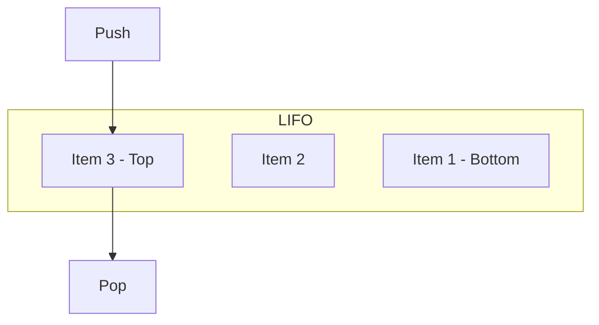

# Stack (栈)

栈是一种后进先出 (LIFO, Last-In First-Out) 的线性数据结构。

## 结构图

## 实现对比
- **SliceStack**: 基于 Go 切片实现。优点是连续内存，访问快。缺点是触发扩容时可能有 O(n) 开销。
- **ListStack**: 基于链表实现。优点是插入/删除性能稳定。缺点是节点内存不连续。

## 操作复杂度
| 操作 | 复杂度 |
| :--- | :--- |
| Push | O(1) |
| Pop | O(1) |
| Peek | O(1) |
| Size | O(1) |
